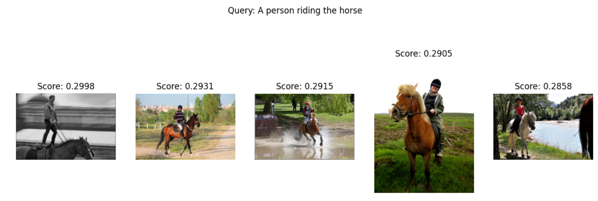

# FCLIP Image Retrieval

This project demonstrates the use of a fine-tuned CLIP model (FCLIP) to perform image-to-image retrieval. Given a **query image**, the model retrieves the **top-5 most similar images** from a dataset based on visual-semantic embeddings.

## Overview

- Uses OpenAI's CLIP model (fine-tuned version) for feature extraction.
- Computes cosine similarity between the query image and dataset images.
- Outputs top-5 visually similar images.
- All results, including the code and output images, are pushed to GitHub.

## How It Works

1. **Load Model**: Load a fine-tuned version of CLIP (FCLIP).
2. **Embed Images**: Extract features from query and dataset images.
3. **Compute Similarity**: Use cosine similarity to find top-5 matches.
4. **Save Results**: Save retrieved images to `top5/` directory.

